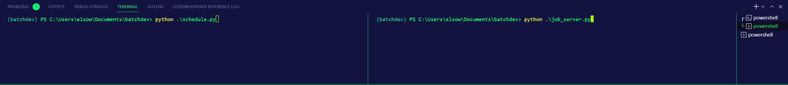
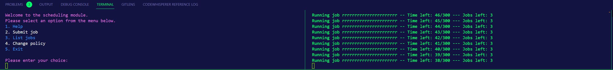

In order to properly run, you will need to setup your venv.

### Setup venv

#### Windows

`.\batchdev\Scripts\activate`

#### Unix/MacOS

`source ./batchdev/bin/activate`

### You will now then need to download the required packages

Either run ` python installer.py`
Or run `pip install -r requirements.txt` in the shell

## Running the server

`python job_server.py`
(runs the server that takes in the requests from the UI/client and handles them)
(spins up a thread to handle the job queue processing)

## Running the UI(Client)

open up another terminal/shell and run `python schedule.py`

<h3>Authors</h3>
<ul>
<li>Delena Ferguson</li>
<li>Keith Grier</li>
<li>Sherief Elsowiny</li>
</ul>

# Job name, Execution time, Priority, Submitted time
